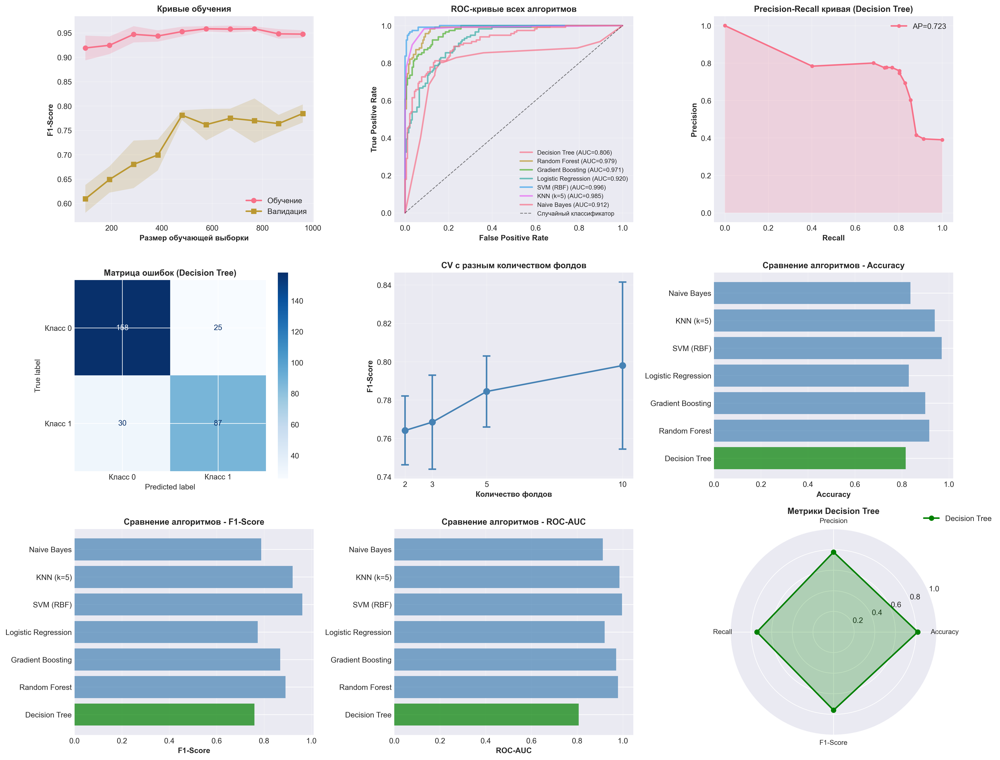

# Intelligent Data Analysis

Лабораторные и практические работы курса **«Интеллектуальный анализ данных»** — от визуализации и статистики до регрессии, деревьев решений и обучения без учителя. Каждая работа — лекционный ноутбук с теорией + практический ноутбук с заданиями на отдельном датасете.

**Стек:** Python, pandas, NumPy, Matplotlib / Seaborn / Plotly, SciPy, statsmodels, scikit-learn, scikit-optimize.

## Содержание

| # | Тема | Датасет | Ноутбуки |
|---|---|---|---|
| [lab1](lab1) | Визуализация данных | Open Food Facts | [лекция](lab1/data_visualization_lecture.ipynb) · [практика](lab1/data_visualization_practice_s.ipynb) |
| [lab2](lab2) | Проверка гипотез, A/B-тестирование | Cookie Cats (мобильная игра) | [лекция](lab2/hypothesis_testing_lecture.ipynb) · [практика](lab2/hypothesis_testing_practice.ipynb) |
| [lab3](lab3) / [lab4](lab4) | Линейная регрессия, EDA, feature engineering | Insurance (медицинская страховка) | [лекция](lab3/linear_regression_lecture.ipynb) · [практика](lab4/module_1_final.ipynb) |
| [prac6](prac6) | Деревья решений, оценка модели | — | [лекция](prac6/decision_trees_lecture.ipynb) · [практика](prac6/decision_trees_practice.ipynb) |
| [unsupervised_learning](unsupervised_learning) | Supervised (логистическая регрессия) + Unsupervised (K-Means, иерархическая кластеризация, DBSCAN) | Titanic | [supervised](unsupervised_learning/supervised_learning_practice_ru.ipynb) · [unsupervised](unsupervised_learning/unsupervised_learning_practice_ru.ipynb) |
| [IDAFinal](IDAFinal) | Итог: инженерия признаков, подбор гиперпараметров, градиентный спуск | — | [feature engineering](IDAFinal/feature_engineering_practice.ipynb) · [gradient descent](IDAFinal/gradient_descent_practice.ipynb) |

## lab4 vs lab3

`lab4` — доработанная версия `lab3`: тот же датасет по страхованию, но уже с отдельным препроцессинг-файлом (`insurance_preprocessed.csv`) — то есть шаг очистки данных вынесен и переиспользуется отдельно от обучения модели.

## Пример результата

Оценка модели дерева решений (`prac6`):

## Прогрессия по сложности

1. **Разведочный анализ и визуализация** (lab1) →
2. **Статистическая проверка гипотез** (lab2) →
3. **Регрессия и EDA на реальных данных** (lab3–4) →
4. **Классификация деревьями решений с подбором гиперпараметров** (prac6) →
5. **Классификация + кластеризация без учителя** (unsupervised_learning) →
6. **Инженерия признаков и градиентный спуск с нуля** (IDAFinal)
